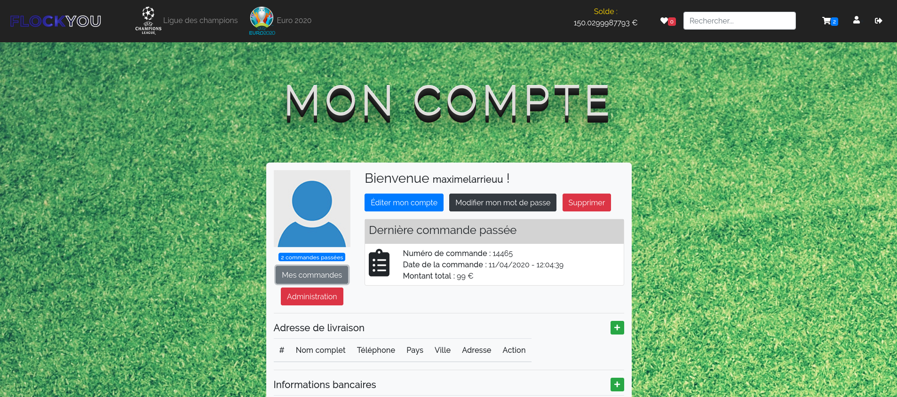

# FlockYou
[Site](/website) e-commerce développé grâce au framework Symfony. L'[application web](/application) dépend de Symfony côté backend et est développé en Angular pour le frontend.

Afin de découvrir une façon d'utiliser des fichiers CSS et JS à intégrer à mon projet pour obtenir un rendu graphique plus personnel, j'utilise le bundle Webpack qui viendra compiler mes fichiers en un seul, pour gagner en performances.

## Détails du projet

### Côté client
Flockyou permettra aux utilisateurs d'acheter en ligne, des maillots de football des plus grandes équipes européennes et nationales. Ces maillots seront personnalisables avec des flocages prédéfinis.

Sans être inscrit, n'importe quel article peut être consulté et ajouté aux favoris grâce à la session de l'utilisateur.

Après avoir créé son compte, un utilisateur aura accès à ses informations personnelles (Adresse de livraison, coordonnées bancaires) mais pourra ajouter ses articles favoris et autres à son panier.

Si un article plaît à l'utilisateur, il pourra choisir la taille qu'il désire, ainsi que le flocage prédéfini selon l'équipe appartenant auquel il appartient.

Ainsi, comme tous site e-Commerce, il est possible d'ajouter des articles choisis dans son panier qui mènera jusqu'à l'achat du ou des produit(s).

Une fois l'achat effectué, le client recevra par mail, le récapitulatif de sa commande sous forme de facture. Le(s) article(s) acheté(s) pourront être notés par l'acheteur.

Dans son espace membre, il lui sera possible de modifier son profil et de consulter toutes les commandes qu'il aura passé sur le site.

##### Quelques screens

### Côté administration

La partie administration est un peu plus complète avec la possibilité évidemment de consulter le nombres de commandes passées, le nombre d'articles vendus ainsi que les revenus générés les 7 derniers jours et bien sûr les revenus globaux. 
Il est également possible de consulter les articles les mieux notés (et les pires). Le stock restant de tous les articles ainsi que les utilisateurs inscrits et leurs commandes passées.

De plus, l'administrateur peut également ajouter de nouveaux articles disponibles à la vente ou modifier des articles déjà existants, voire en supprimer. Ce qui lui est également possible pour les équipes, ligues ou encore les flocages.

##### Quelques screens

